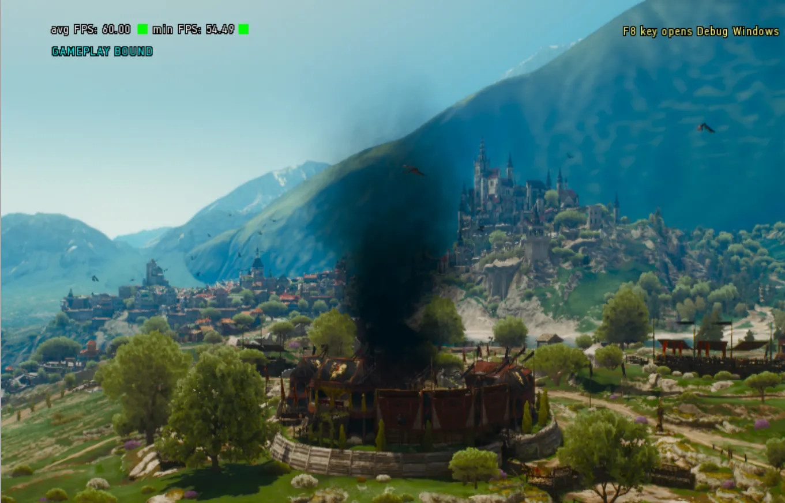
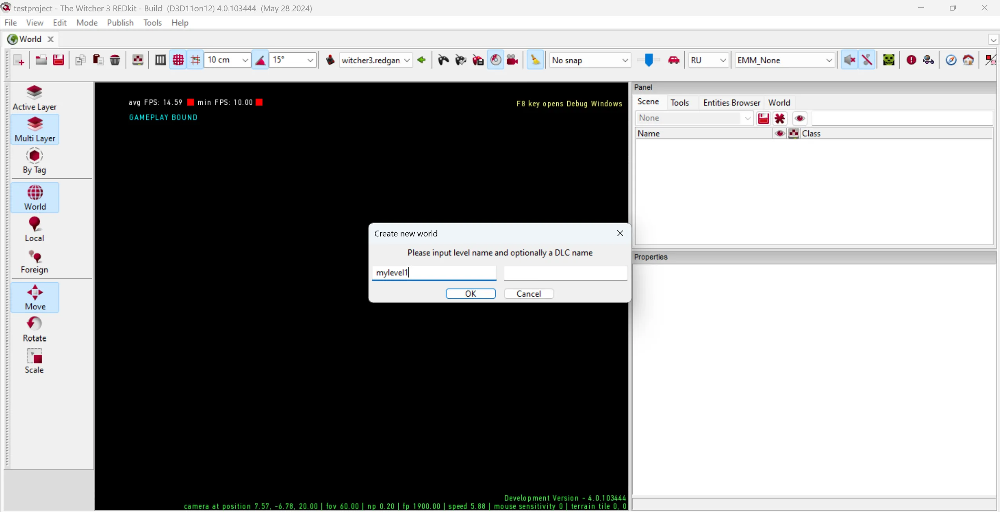

---
tags:
  - Basics
  - General Information
  - World
  - Level Design
  - world
  - w2w

status: new

---

# World
The **World** is the central entity of the REDkit project and 
represents the main scene of a game level.

## General Information

According to the Witcher 3 concept, **Worlds** divide the game into zones of interest and 
implement specific sections of the global map.

Within a **World**, the following are placed: terrain, game objects (meshes, entities), triggers, 
scripts, and other elements of interaction with the player.

Examples of existing game worlds include White Orchard, Novigrad, Skellige, and others.

## Working with Worlds
To start working, you’ll need to load an existing **World** or create your own.

Since the best way to get acquainted with REDkit is to study the original game content, 
we’ll first look at ways to find and open existing game worlds.

### Loading an Existing World
To open a game **World**, you’ll need to find one of the W2W files in the Asset Browser.

Although most worlds are located in expected places (e.g., the "levels" folder), 
the fastest and most efficient way to find the desired world is to use the built-in search.

To do this:

1. In the "Class:" window, select the type "CWorld".
2. In the search window, enter ".w2w".
3. Make sure the search mode is set to search the entire library.
4. Press Enter.

As a result of the search, you’ll see all available game worlds, including those you’ve created. 
To open a world, press Enter or double-click with the left mouse button.

!!! info "Tip"
    To find the location of the found file, 
    right-click on the file and select "Go to resource home."

## Creating a New World
If you’re ready to start creating your own world, it’s very easy to do.

To do this:
In the main "World" window:

1. Select the menu "File > New World".
2. In the window that opens, specify the name of your game **World**.
3. If necessary, specify the DLC name (see the "DLC Features" section below).

### DLC Features

In The Witcher 3, there is a division between:

1. The main (vanilla) game.
2. Expansions (DLC).

For a mod integrated into the main game, the "DLC name" field can be left empty.

For a standalone DLC, you must specify a name in the "DLC name" field.

In reality, this only affects where the editor creates the directory for the world in the Asset Browser. 
It will be either `/level/world_name` if the "DLC name" field is empty, 
or `/dlc/dlc_name/data/levels/world_name`.
You can always move the world between spaces.

## Working with the World

### Scene

{ style="width: 75%;" }

The Scene panel displays the structure of the current **World**. 
It is organized as a hierarchical structure of directories 
containing layers with game entities.

Directories are logical groupings for other directories and layers within them.

For example:

- `fx` - contains layers with visual effects used in the level.
- `environment` - layers with environmental elements.
- `quest` - layers with elements for specific quests.

A layer, in turn, combines basic game elements such as meshes, paths, 
triggers, zones, etc.

[//]: # (More about layers and working with them)

!!! info "Note"
    Although directory and layer names are not strictly mandatory, 
    it is recommended to follow the naming conventions 
    used in the base game for better organization and project maintenance.

### Tools
Most of the tools you’ll need to populate your **World** are located in this tab.

For example: To create terrain, you’ll need the "Terrain Edit Tools", 
and to test animations for different NPCs within your **World**, the "Test Anim" tool will help.

Each tool requires a separate overview and will be covered in future lessons.

### World

Before you start creating/editing terrain 
or placing new objects on layers, you need to configure the global properties of the world located in this tab.
They are comprehensive, and you can find their detailed description [here](../../references/world/world_params.md).

***
Author: lxgdark

*Documentation is maintained by the [REDkit RU](https://discord.gg/kRTEy8KcNa) community members.*

_The translation into English is done using the LLM._
***
