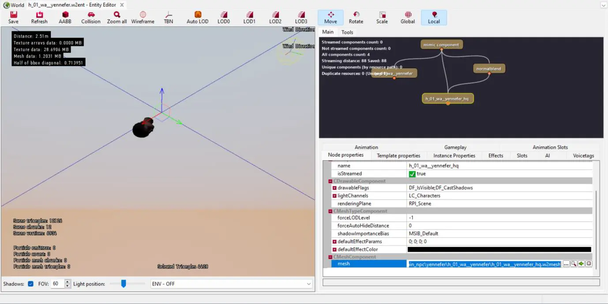
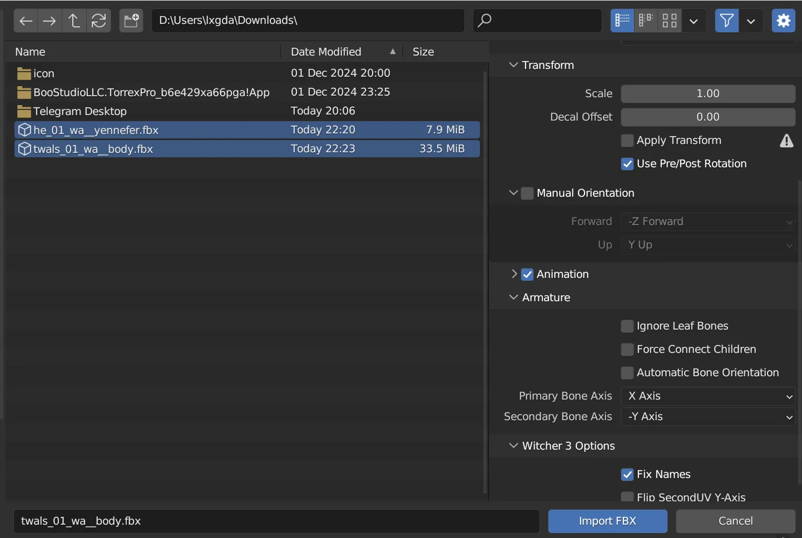
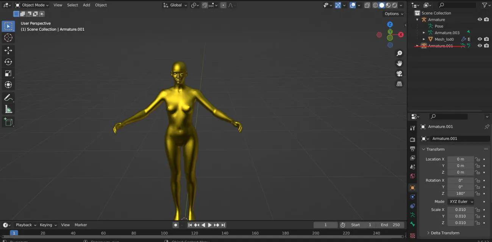
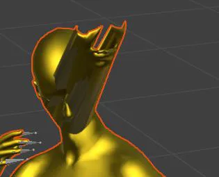

---
tags:
  - Guide
  - Animations
  - NPC
  - blender
  - Cascadeur
---

# How to Create Your Own Animation for NPCs

This guide provides step-by-step instructions for creating and implementing custom animations.

### You will need:
- [Blender](https://www.blender.org/download/) (latest version). As of writing, this is version 4.3.1.
- [Blender version 3.6](https://www.blender.org/download/releases/3-6/) (which supports an important plugin).
- (Optional) Full version of Cascadeur animation software. 
  The free version won’t work because it doesn’t support FBX export.
- Fix for [FBX Import Addon for Blender](https://www.nexusmods.com/witcher3/mods/8105). 
  I use the version compatible with Blender 3.6, as it has proven to be the most stable.
- (Optional) Plugin [Cascadeur Bridge for Blender](https://github.com/arcsikex/cascadeur_bridge). 
  The plugin version depends on your Cascadeur version (read the plugin description). 
  The plugin is installed on the latest version of Blender.

## Step 1: Choosing the Model for Animation
First, decide which NPC you will create the animation for. This choice is important because 
the base skeletons differ between characters, even between humans of different genders. 
For other races, the differences are even greater.

!!! note "Comment"
    Animations for the main character will be covered in a separate lesson, as there may be 
    additional nuances in this case.

For demonstration purposes in this lesson, I will create an animation for a human female. 
As an example, let’s take Yennefer. Open her main entity template (**Entity**):

`characters\npc_entities\main_npc\yennefer.w2ent`

1. Go to the "**Appearances**" tab. Here, you’ll see a list of appearance options for this 
   character. This list will help us find the source models we’ll work with.
   Choose the option you want to work with.

    !!! note "Comment"
        Ideally, animations should be universal and independent of the character’s appearance. 
        However, if the animation is directly related to clothing elements, 
        choose the option with that clothing.

    Since I plan to create a simple animation, the most convenient model to use is 
    the one without unnecessary details – **yennefer_naked**.

    

     After selecting the appearance option, the right side will display what it consists of. 
    The simplest option includes the body, head, and hair. We’ll only need the body and head.

2. Double-click on the element in the list, and you’ll be taken to it in the **Asset Browser**. 
   These actions will help us find Yennefer’s individual parts in the folder hierarchy, 
   but this isn’t exactly what we need yet.

3. Now that you’ve found the template for the specific element, open it and find the element 
   in the graph that is responsible for the **mesh** (model) of the element.

    

4. At the bottom, in the properties list, you’ll see the path to the model. 
   Click the magnifying glass icon in the path line, and the file we need will be highlighted 
   in the **Asset Browser**. In my case:

    `characters\models\main_npc\yennefer\h_01_wa__yennefer\h_01_wa__yennefer_hq.w2mesh`

5. Right-click on the file and select **"Export Asset"**. 
   Save the FBX file to a convenient location.
   Repeat this process for the second body part.

!!! info
    The entire process described is needed to find the necessary body part models. 
    If you already know where the required meshes are located, you can skip directly to exporting them to FBX.

## Step 2: Preparing the Model
At this stage, we need to prepare the model for animation.

For this, you’ll need [Blender 3.6](https://www.blender.org/download/releases/3-6/) 
with the [FBX Import Addon for Blender](https://github.com/arcsikex/cascadeur_bridge) fix installed. 
Note that this is not a standalone addon but a fix for the existing FBX import addon.
Install it by following the instructions on the fix page.

!!! note "Comment"
    You can use another version of Blender, depending on the available fix variations. 
    However, in my experience, the version for Blender 3.6 has proven to be the most stable.

### Importing FBX Files
After installing the fix, open Blender 3.6 and delete all starter elements. 
Then follow these steps:

1. Go to the menu: "File --> Import --> FBX". 
2. Select both files you previously exported from **REDkit**. 
3. In the import settings, be sure to change the values for **Primary Bone Axis** and **Secondary Bone Axis**.
    - Set them to X/-Y (this differs from the developers’ recommendations in their tutorial article).
    
    !!! note ""
        During experiments, I found that these settings work correctly.
        Later in the process, I’ll explain why.

### Understanding the FBX Situation
Before continuing, let’s understand what’s happening here.

During standard FBX import, the information about the skeleton’s binding to the model is lost.
This means you won’t be able to control the model by manipulating the skeleton. 
This is why we’re using Blender 3.6 with the community fix.

### Preparing the Model

After importing the models, do the following:

**Clean it of unnecessary elements.**

Delete the LOD (Level of Detail) variations of the models. To do this, 
select the corresponding elements in the list and press **x**.

**Merge the model parts.**

To simplify further work, merge the head and body into one model. 
To do this:

- Hold ++shift++ and select the head and body in the editor window (the selection order matters). 
- Press ++ctrl+j++ to merge them into one.

**Clear unnecessary data in the Armature.001 block.**

This block contains bone information that isn’t needed for our task (it relates to facial expressions, which aren’t covered in this lesson).

Delete this element similarly to how you deleted the LOD.

!!! success ""
    The preparatory stage is complete. The model is ready for further work.

## Step 3: Starting Animation.

Further work will take place in the latest version of Blender (in my case, 4.3.1 from Steam). 

### Transferring the Model to the New Blender Version
1. Open the latest version of Blender alongside the already open version 3.6.
2. Return to Blender 3.6, click on an empty space in the editor, and press ++a++ to select all elements.
3. Copy them by pressing ++ctrl+c++, then switch to the latest version of Blender.
4. Paste the copied elements by pressing ++ctrl+v++.

At this point, the model is almost ready for animation, but it has a few issues that need to be resolved.

1. The current bone setup isn’t suitable for creating animations.
2. The head has weight issues because the model is designed for facial expressions.

Let’s fix both issues one by one:

### Fixing the Bones

To solve the bone issue, you can use a simple hack – load a ready-made animation onto the current model.

1. Install the addon from the developers that allows importing `.re` files into Blender.
    You can find installation instructions in this [video](https://www.youtube.com/watch?v=wXQRwfslN4Q).
2. Decide on the animation you’ll use as a base. Since we ultimately need just one pose, 
   the choice of animation should be based on whether it contains a suitable pose. For example:
       - If you want to start the animation from a neutral pose, find any animation that also starts with it.
       - If you want your animation to continue another, choose the one you want to continue from 
       (later, we’ll take the final pose and continue from it).

    !!! warning "Important"
        The animation must be selected from the set for the current NPC type. In our case, a human female.

    !!! info
        All animations are located in the "**Animation**" folder in `.w2anims` files. 
        The video above shows an example of how to select an animation and save it in `.re` format.

3. After selecting and exporting the animation, return to Blender. 
    - In the elements list, select "**Armature**" and right-click.  
    - Choose the menu item "**Replace Animation from an .re file**".
    - In the import settings, be sure to set "Object scale" to one.

    

If you’ve done everything correctly, the skeleton will be replaced with a more accurate one, 
and pressing the spacebar will make the model perform the loaded animation.

!!! warning "Note"
    If instead of "Replace Animation…", you choose **Import**, 
    the animation will load separately and will represent an empty skeleton. 
    Since this import doesn’t contain coordinate settings, it’s important that the model 
    onto which the skeleton is overlaid matches its orientation. 
    This is why we chose the -Y direction during the FBX import stage described above. 
    Since the skeleton faces the -Y direction, we selected it during import.

### Fixing Weights
Now let’s move on to the second issue.

{ style="width: 30%;" }

Some facial elements don’t respond to the animation because they lack weight information. 

Let’s fix this manually:

1. Select the model and switch to "**Weight Paint**" editing mode.
2. In the top part of the interface, in the vertex list, select "**head**".

    

3. Add weight to the problematic areas by clicking on them several times.
4. If you’ve done everything correctly, the issue will disappear.

    

!!! success "Ready to Work" 
    At this point, you can already create a new animation directly in Blender, 
    if you have the necessary skills. However, I plan to use a more advanced tool.

## Step 4: Cascadeur.

Cascadeur is a program for creating animations with a key feature: physically correct behavior. 
By creating animations in Cascadeur, you significantly simplify your task, 
allowing you to achieve smoother and more physically realistic animations much faster.

!!! warning "Important"
    Unfortunately, the free version of the program doesn’t support FBX export, 
    making it impossible to return the work back.
    So, if you don’t have access to the full version (e.g., from the "green store"), 
    and don't know where to get the full version, you can skip this part of the lesson.

### Transferring the Model to Cascadeur

To start working, we need to transfer our model to Cascadeur.

Although you can use the standard FBX import/export process, an enthusiast 
[Aron Nemeth](https://www.youtube.com/@AronNemeth95) 
created a much more convenient tool – [Cascadeur Bridge for Blender](https://github.com/arcsikex/cascadeur_bridge). 

This plugin allows Blender and Cascadeur to interact directly without the hassle of files.

1. Download and install this plugin, ensuring its version matches your Cascadeur version.
   (In my case, Cascadeur 2023.1 and plugin version 1.0.0)

2. Configure the plugin by following the developer’s instructions. 
   A detailed description of the plugin’s operation can be found
   [in this video](https://www.youtube.com/watch?v=0muo9EPIPSE).

### Matching the Skeleton

To fully utilize the program’s capabilities, we need to match the skeleton 
of our model with Cascadeur’s internal system.

This is easily done using the built-in tool, described [here](https://www.youtube.com/watch?v=gPOh1MT8Tlk).

After completing the matching, don’t forget to export (save) the settings for future use.

As a result of this work, we’ll get the following:

!!! success
    Now you can create animations, relying on numerous tutorial videos available online.

### Returning the Animation to Blender

After finishing the animation creation:

1. Return to Blender and select the object’s armature.
2. In the Cascadeur Bridge addon module, click "Import Action".
3. After a while, the animation will be transferred to Blender.

Now we’re ready to transfer the animation to REDkit.

## Step 5: Adding/Replacing Animation in REDkit.

To export the animation into the game:

1. In Blender, select the menu "File --> Export --> RE", enter the desired name, and click **Export**.

    !!! warning "Attention"
        The choice of name for your animation is important, as it can cause issues in certain scenarios: 
    
        - If this animation is responsible for behavior, 
        its name must match the name from another animation set for behavior.
    
        !!! note ""
            For a brief overview of the behavior system, see [here](../base/behavior/behavior.md)
    
        - If the animation is intended for scenes, ensure the name reflects its purpose to 
        make it easier to find in the future.

2. After creating the `.re` file, return to REDkit.  
3. Select the animation set to which you’ll add the new animation (or create a new set). 
4. Open the set and click on its name in the "**All animation**" tab, 
then right-click and select "**import simple/plain animation**".

Yennefer waves at you. Wave back 😊

!!! note
    There are some pitfalls and issues you might encounter while working with custom 
    animations in REDkit. These will be covered separately.

***
Author: lxgdark

*Documentation is maintained by the [REDkit RU](https://discord.gg/kRTEy8KcNa) community members.*

_The translation into English is done using the LLM._

***