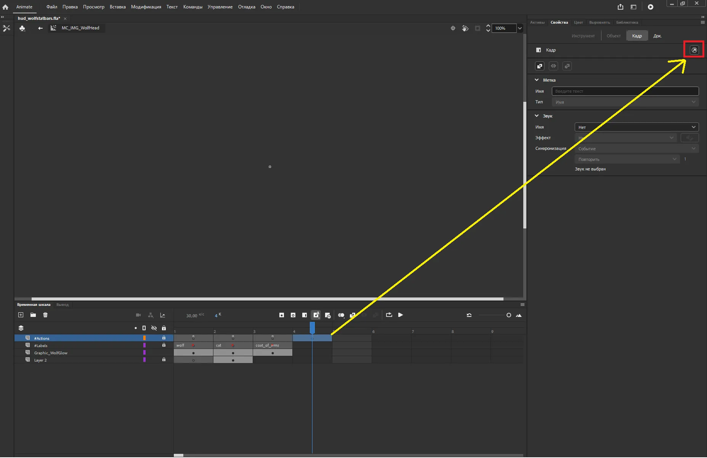
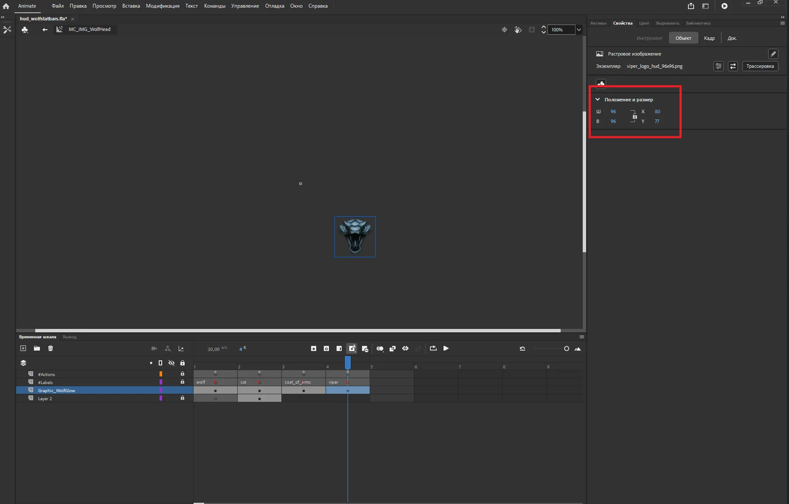

---
tags:
  - Guide
  - UI
  - Scripts
  - Flash
  - Adobe Animate
  - .fla
  - .swf
  - .redswf
  - .as
  - .ws

status: new

---

# How to Create Your Own Medallion in HUD

In the game, you can change medallions in the HUD, which happens when switching to play as Ciri and during gameplay as Vlodimir in the DLC.

In this guide, we'll add our own medallion icon and replace it step by step.

**Some theory**:

The interface in the game is made with Adobe Flash. UI elements are mostly movie clip components.

Each can have frame-by-frame animation, and this is used to switch between different interface states.
Each animation frame is essentially a separate "layer" that can be turned on and off.

Through this guide, we'll learn how the switching system works using an example.
This will help not only to replace the medallion icon but also to learn how to switch any parts of the UI and give you a deeper understanding of how the UI works.


**What you'll need**:

- **Adobe Animate** - for editing .fla and building .swf _(Where to get Adobe software - figure it out yourself)_
- **Visual Studio Code** with the [ActionScript & MXML](https://marketplace.visualstudio.com/items/?itemName=bowlerhatllc.vscode-as3mxml) plugin
(optional - for convenient work with Action Script)


## Step 0. Copy the necessary files

For convenient work with the interface, check out the entire `gui_new` directory to your workspace:

- Go to `redkit_folder\r4data\gameplay` and copy the **gui_new** folder from there
- Paste it into your workspace in the **gameplay** folder
- To prevent the editor from thinking you've edited the entire UI, delete all files with the `.redswf` extension in the `workspace\gui_new\swf` folder
and all subfolders

## Step 1. Add the icon to the fla

- Open the file `gui_new\fla\witcher3\hud\hud_wolfstatbars.fla` in **Adobe Animate**
- Find `mcWolfsHead` on the timeline
- Select the first frame and press **F9**
- The actions menu will open, find **MC_IMG_WolfHead** and click on any frame


This will take you inside the component. There will be 4 layers and 3 frames for each medallion.

On the **#Actions** layer:

- Right-click --> **Insert Blank Keyframe**
- In the properties (if properties are not visible, go to **Window** and click on **Properties**) click on the arrow, this will open a text editor
- Paste one line into it:
    ```actionscript linenums="1"
    stop();
    ```
    


On the **#Labels** layer:

- Right-click --> **Insert Blank Keyframe**
- In its properties, set a name, this is the identifier that Action Script needs to select the frame.
    

On the **Graphic_WolfGlow** layer:

- Right-click --> **Insert Blank Keyframe**
- Drag your icon from the explorer directly onto the stage
- Position and scale it as needed with the mouse or in the properties in the object tab
    

Save the `.fla` with ++ctrl+s++, minimize Animate for now and continue.

## Step 2. Write a function to replace the medallion

We need a function in Action Script that will change the medallion.

1. Initialize a new **vscode** project in the `gui_new\actionscript` directory.
2. Go to the file `red\game\witcher3\hud\modules\HudModuleWolfHead.as`
3. Add a new public function, for example I'll add this one:

```actionscript linenums="1"
public function setLethoAsMainCharacter( value : Boolean )
{
   if ( value )
   {
       mcWolfsHead.SetMedalionGraphic("viper");
   }
   else
   {
       mcWolfsHead.SetMedalionGraphic("wolf");
   }
}
```

??? tip "Now let's understand what's happening here"

    We call `SetMedalionGraphic`, which does this:
    
    ```actionscript linenums="1"

    public function SetMedalionGraphic( value : String )
    {
        gotoAndStop(value);
        mcWolfGlow = getChildByName("mcWolfGlow") as MovieClip;
        mcWolfGlow.gotoAndStop(1);
    }
    ```
    
    This function is located in red\game\witcher3\hud\modules\wolfHead\WolfMedallion.as
    
    This is a good reference for how switching works. Using this example, you can write a function to switch other parts.

Save the file and continue.

## Step 3. Compile the redswf

1. Return to Adobe Animate. 
2. File --> Publish. 

    !!!warning "Important!"
        If the swf file is read-only (for example, due to perforce) - Animate will give an error. 
        You need to open the file `gui_new\swf\hud\hud_wolfstatbars.swf` for editing

3. Go to REDkit in the folder `gameplay\gui_new\swf\hud`
4. Right-click --> **Import** --> **Flash SWF** 
5. Specify the path to the above-mentioned SWF, confirm the replacement and checkout

## Step 4. Connect the function in witcher script

1. Go to Tools --> Script Studio
2. Create a new script file wherever convenient for you and paste, editing what is marked by comments: 

```ws linenums="1"
@addField(CR4HudModuleWolfHead)
// New variable for the flash function object, name it as you want
private var m_fxSetLethoAsMainCharacter : CScriptedFlashFunction; 

@replaceMethod(CR4HudModuleWolfHead)
function OnConfigUI()
{
    var flashModule : CScriptedFlashSprite;
    var hud : CR4ScriptedHud;
    
    m_anchorName = "mcAnchorWolfHead";
    
    super.OnConfigUI();
    
    flashModule = GetModuleFlash();	
    
    m_fxSetVitality						= flashModule.GetMemberFlashFunction( "setVitality" );
    m_fxSetStamina						= flashModule.GetMemberFlashFunction( "setStamina" );
    m_fxSetToxicity						= flashModule.GetMemberFlashFunction( "setToxicity" );
    m_fxSetExperience					= flashModule.GetMemberFlashFunction( "setExperience" );
    m_fxSetLockedToxicity				= flashModule.GetMemberFlashFunction( "setLockedToxicity" );
    m_fxSetDeadlyToxicity				= flashModule.GetMemberFlashFunction( "setDeadlyToxicity" );
    m_fxShowStaminaNeeded				= flashModule.GetMemberFlashFunction( "showStaminaNeeded" );
    m_fxSwitchWolfActivation			= flashModule.GetMemberFlashFunction( "switchWolfActivation" );
    m_fxSetSignIconSFF 					= flashModule.GetMemberFlashFunction( "setSignIcon" );
    m_fxSetSignTextSFF 					= flashModule.GetMemberFlashFunction( "setSignText" );
    m_fxSetFocusPointsSFF				= flashModule.GetMemberFlashFunction( "setFocusPoints" );
    m_fxSetFocusProgressSFF				= flashModule.GetMemberFlashFunction( "UpdateFocusPointsBar" );
    m_fxLockFocusPointsSFF				= flashModule.GetMemberFlashFunction( "lockFocusPoints" );
    m_fxSetCiriAsMainCharacter			= flashModule.GetMemberFlashFunction( "setCiriAsMainCharacter" );
    m_fxSetCoatOfArms					= flashModule.GetMemberFlashFunction( "setCoatOfArms" );
    m_fxSetShowNewLevelIndicator		= flashModule.GetMemberFlashFunction( "setShowNewLevelIndicator" );
    m_fxSetAlwaysDisplayed				= flashModule.GetMemberFlashFunction( "setAlwaysDisplayed" );
    m_fxshowMutationFeedback			= flashModule.GetMemberFlashFunction( "showMutationFeedback" );

    // Name of the newly created variable
    // Replace setLethoAsMainCharacter with the function name from step 2
    m_fxSetLethoAsMainCharacter         = flashModule.GetMemberFlashFunction("setLethoAsMainCharacter"); 
    
    m_CurrentSelectedSign = thePlayer.GetEquippedSign();
    m_fxSetSignIconSFF.InvokeSelfOneArg(FlashArgString(GetSignIcon()));
    
    SetTickInterval( 0.5 );
    hud = (CR4ScriptedHud)theGame.GetHud();
    if (hud)
    {
        hud.UpdateHudConfig('WolfMedalion', true);
    }
    DisplayNewLevelIndicator();
    
    UpdateCoatOfArms();
}

@addMethod(CR4HudModuleWolfHead)
// New function to change the medallion, name it as you want
public function SetLethoAsMainCharacter(value : bool)
{
    // Insert your variable here
    m_fxSetLethoAsMainCharacter.InvokeSelfOneArg(FlashArgBool(value));
}
```

## Step 5. Test function

Let's create a test function for changing the medallion, which will also serve as an example of how to work with this:

```ws linenums="1"
// Name it as you want
exec function test_set_letho_hud(val : bool)
{
    var hud : CR4ScriptedHud;
    var hudWolfHeadModule : CR4HudModuleWolfHead;      

    hud = (CR4ScriptedHud)theGame.GetHud();
    if (hud)
    {
        hudWolfHeadModule = (CR4HudModuleWolfHead)hud.GetHudModule("WolfHeadModule");
        if (hudWolfHeadModule)
        {
            hudWolfHeadModule.SetLethoAsMainCharacter(val); // Insert your function here
        }
    }
}

```
At the top of Script Studio, click on the red square with two arrows - this is script compilation:


There should be no errors in the console, the last line should be: `Script compilation finished successfully.`

!!! success "Done!"
    Run the command in the console and pass true to it (in my case test_set_letho_hud(true)),
    make sure the medallion has been replaced.

    

***
Author: leviofanh

*Documentation is maintained by the [REDkit RU](https://discord.gg/kRTEy8KcNa) community members.*

_The translation into English is done using the LLM._

***