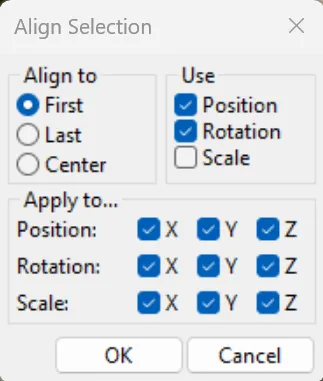

---
tags:
  - Useful
  - Editor
  - Keyboard Shortcuts
---

# Useful Keyboard Shortcuts

A collection of useful hotkeys for solving routine tasks in the editor.

## World Editor
### Objects

- Select two objects on the map and press ++m++ to copy transformation properties and coordinates. 
  Allows you to transfer any transformation values from one object to another. 
  In the case of position, it also allows you to center objects relative to each other. 
  For example, you’ve placed the exterior of a house on the map and now want to place the interior so that it matches. 
  This tool will help set the interior to the exterior’s coordinates, 
  as well as apply rotations and scaling (if any).

    { style="width: 25%;" }


- When you have an object selected, you can duplicate it along one of the axes.
  To do this, hold ++shift++ and move the object in the desired direction.
  Useful for building fences, scattering rocks, and other landscape work
  that requires duplicating elements along one of the coordinate axes.

    { style="width: 25%;" }

- ++x++ / ++y++ / ++z++ for quick movement along the corresponding axis.
  Useful if it’s difficult to grab the desired axis arrow in the current camera position.

    { style="width: 25%;" }

- ++ctrl+shift+e++ – select all similar w2ent objects within a small radius. 
  Allows you to select all nearby identical objects for group editing.

### Camera

- ++w++ / ++a++ / ++s++ / ++d++ – move around the map. 
  You can also use ++left mouse button++ + mouse movement (but this option is less responsive).

- ++"right mouse button"++ – rotate the camera.
- ++shift++ – speeds up camera movement by 5 times.
- ++"left mouse button"+"mouse wheel scroll"++ – increase/decrease camera speed.
    
- ++j++ – quickly move to the point where the cursor is pointing. 
  The cursor must point to an object or terrain (not into empty space). 
  Useful for quick navigation on the map.
- ++ctrl+alt+"0...9"++ – saves the current camera position. 
  ++ctrl+"0...9"++ allows you to quickly return to the saved positions. 
  Useful for marking favorite spots on the map or viewing something from a specific angle.
- ++ctrl+alt+c++ – copies the camera position.
- ++ctrl+alt+v++ – moves the camera to the previously copied coordinates.

### Terrain

- ++"Mouse wheel scroll"++ – changes the brush size.

  _When using Shape Brush - Stamp._
    

- ++"~"++ – inverts the Stamp, allowing you to draw relief depressions. Depends on the Intensity setting.
- ++ctrl+"mouse movement left/right"++ – allows you to quickly change the stamp angle.
- ++alt+"left mouse button"++ – when using Stamp, allows you to clone terrain, including textures. 
  If you set fallout to 0, the terrain won’t change when drawing with this stamp, 
  only the textures will be transferred. Useful for creating typical landscapes with pre-prepared patterns.

    

- ++alt+"left/right mouse button"++ on a material in the materials list sets it as a vertical/horizontal mask. 
  The mask allows you to paint only on the texture selected in the mask. 
  If you enable the Inv checkbox, painting will occur on all textures except the one in the mask.

    

## Game Debugging

- ++alt+enter++ – fullscreen mode. If a second monitor is available, the game will expand to it.
- ++"`"++ – opens the debug console.
- ++f10++ – ends the game debugging session.
- ++"Pause/Break"++ – pauses the game and returns focus to the editor. 
  Useful if, for example, you want to trigger quest debugging or other debuggers.
- ++num-plus++ or ++num-minus++ – increases/decreases time speed. Allows you to speed up or slow down everything in the game. 
  As a result, Geralt can move like Sonic or, conversely, crawl as if after a drinking session. 
  Useful for fast-forwarding time or quickly moving around the map. 
  Or, conversely, for better examining animations in slow motion.
- ++num1++ – kills all enemies within a small radius.
- ++num2++ – kills the enemy Geralt is looking at. 
  Useful for debugging game scripts without wasting time on combat.

***
Authors: lxgdark, x4lva

*Documentation is maintained by the [REDkit RU](https://discord.gg/kRTEy8KcNa) community members.*

_The translation into English is done using the LLM._
***
```