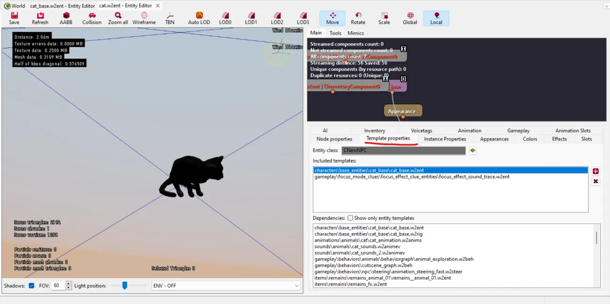
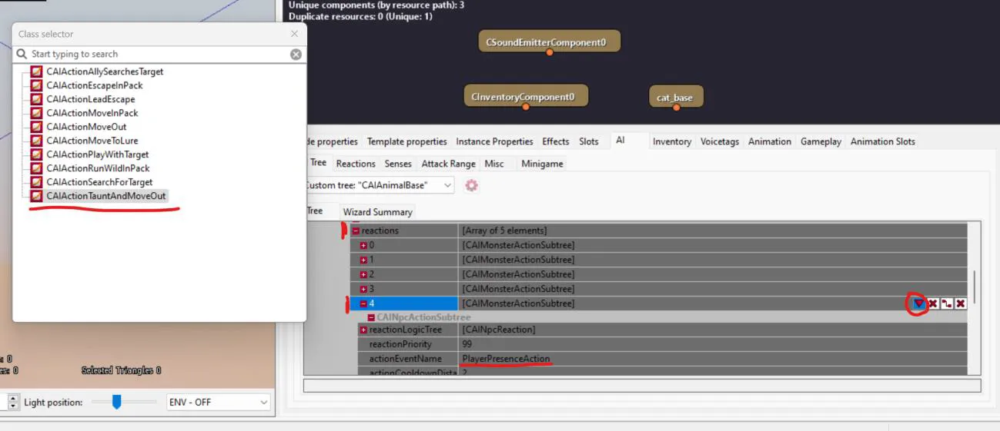
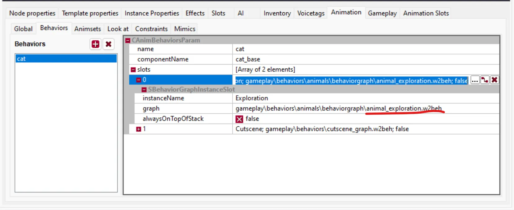
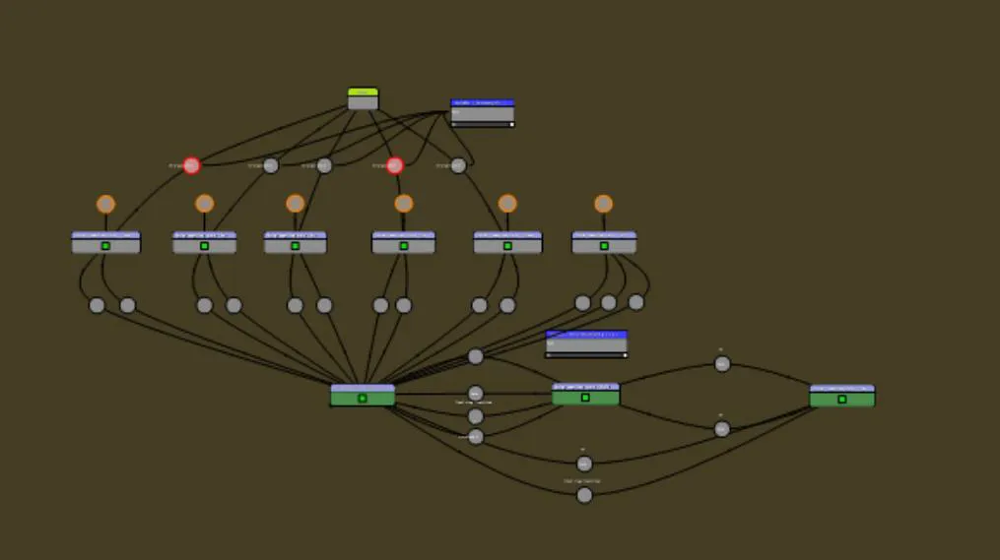
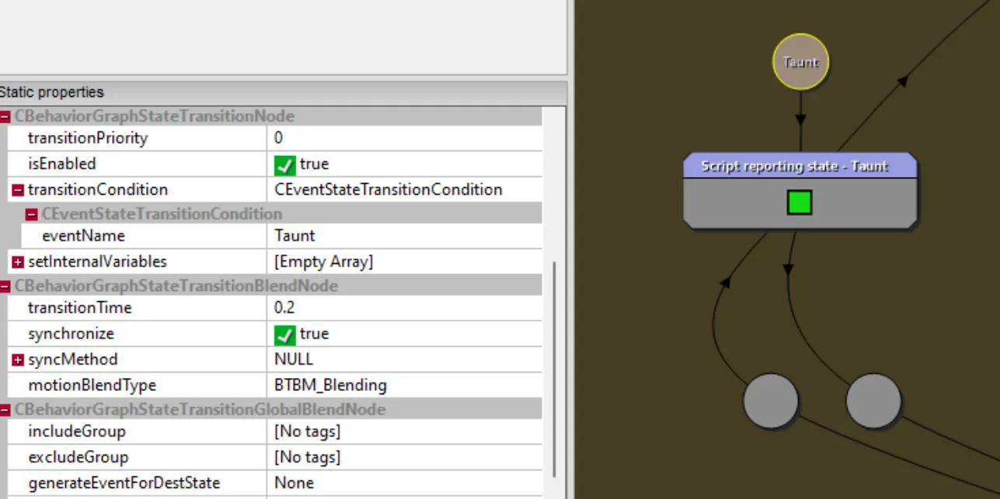
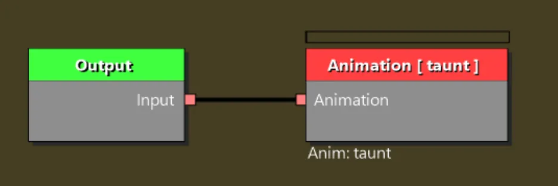
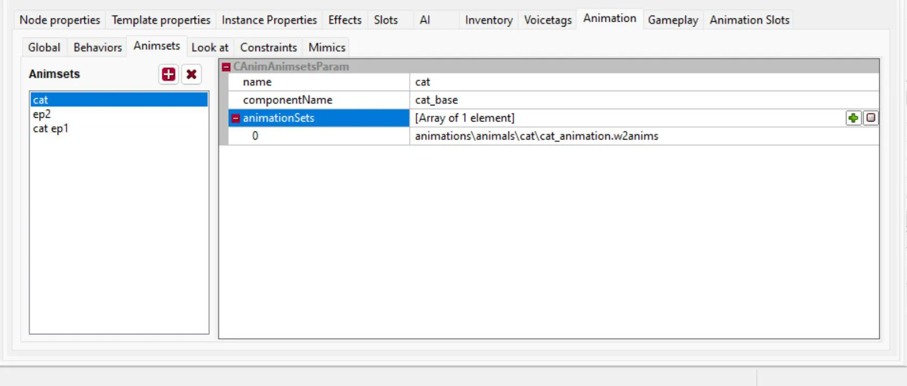
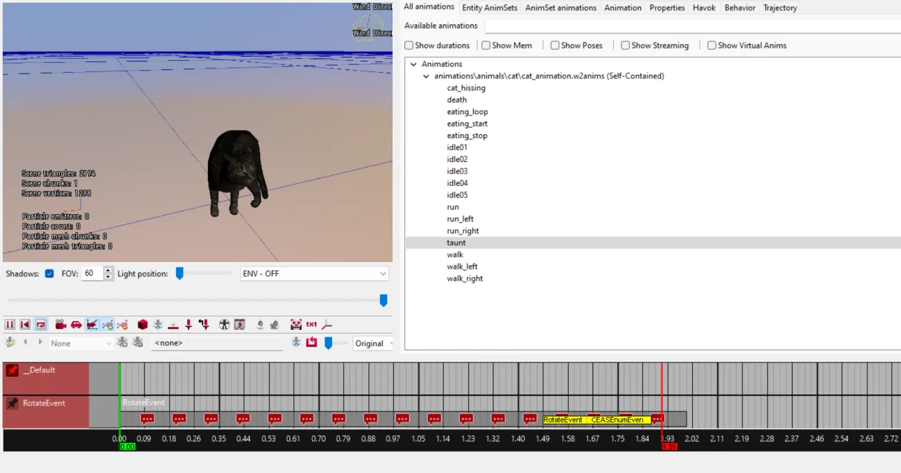

---
tags:
  - Основы
  - Общие сведения
  - Поведения
  - Behavior
  - w2behtree
  - w2beh
---

# Общие сведения о системе поведений 

## Поведение (на примере шипящего котика)

При встрече с игроком коты в игре начинают шипеть. 
Это стандартное поведение ИИ определено в сложной системе поведений «behavior».

Для понимания общей структуры работы поведений нужно пройти некоторый исследовательский путь.

Для начала откроем шаблон кота и посмотрим на основные настройки во вкладке «**Template properties**»



Здесь мы увидим указатель на базовый шаблон, применённый к данному коту.

Такая иерархия нужна, если мы хотим создавать другие шаблоны котиков, но при этом сохранить их базовые поведения и свойства.

Итак, поведение любого кота определяется его базовым шаблоном:

`"characters\base_entities\cat_base\cat_base.w2ent"`

Открыв шаблон, переходим на вкладку «**AI**» и подвкладку «**AI Tree**». 
Здесь и определены шаблоны поведения нашего котика.

Причем важно понимать, что кот — это животное, и многие параметры поведения будет едины для других животных. 
Поэтому в верхнем комбобоксе редактор сразу дает выбор из нескольких базовых заготовок поведения. 
Выбрав заготовку, вы определите перечень параметров, которые нужно настроить для конкретного NPC. 
Базовые заготовки определены в файлах скриптов и основываются на специальных деревьях поведений, которые мы рассмотрим позже.

Чтобы понять, что заставляет кота шипеть при виде игрока, ищем среди параметров настройки, 
логически подходящие под это действие.

Там мы найдем следующие параметры (см. скрин):


Коллекция `reactionTree` содержит несколько различных реакций на внешние раздражители. Нужная нам реакция выглядит так:



Определив реакцию, отвечающую за поведение при присутствии игрока, теперь ищем информацию о ней в скриптах

```ws hl_lines="12"
class CAIActionTauntAndMoveOut extends CAIMonsterActionSubtree
{	
	default reactionPriority 		= 20;
	default actionEventName 		= 'PlayerPresenceAction';
	default actionCooldownDistance 	= 2;
	default actionCooldownTimeout 	= 1;
		
	default disallowOutsideOfGuardArea 			= true;
	default forwardAvailabilityToReactionTree 	= true;
	function Init()
	{
		reactionLogicTree = new CAINpcReactionTauntAndMoveOut in this;
		reactionLogicTree.OnCreated();		
	}
};
```
По сути, этот класс описывает значение параметров по-умолчанию для данного типа реакции.
Нас же интересует параметр, который устанавливается в виде логического дерева для этой реакции.

```ws linenums="1"
class CAINpcReactionTauntAndMoveOut extends CAINpcReaction
{	
	default aiTreeName = "gameplay\trees\reactions\reaction_taunt_and_move_out.w2behtree";
};
```


Найдя этот класс, мы видим то, что искали. 
Ссылку на файл, определяющий поведение в случае возникновения описанной выше ситуации.

Деревья в файлах `w2behtree` требуют отдельного изучения, поскольку это довольно сложная система. 
Однако в 99% случаев вам не потребуется их редактировать или создавать новые, 
Большинство задач можно решить с использованием существующих деревьев.

Писать новое дерево придётся только при создании совершенно новой игровой механики, затрагивающей всех NPC.

Но вернёмся к шипящему котику. Найденное нами дерево кроме прочих действий, 
генерирует событие анимации «**Taunt**», заставляющее котика шипеть.


### Визуальная часть поведения
Теперь разберёмся, как это проявляется визуально.

Мы выяснили, что у котика определен параметр реакции на присутствие игрока. 
Некие (пока не понятно какие) скрипты вызывают это событие всем NPC поблизости, активируя файлы-деревья, 
где описано, как реагировать.
Все это происходит как бы в мозгах (логике), но что насчет визуального выражения?

Тут вступает вторая часть поведений – визуальной.

Вернемся к базовому котику и перейдем на вкладку «**Animation**», подвкладку «**Behaviors**». 
Здесь определены все анимации для всех возможных ситуации текущего NPC

Конкретно у котика определено два типа анимаций поведений: обычные и для кат-сцен. 
Поскольку коты — фоновые и довольно простые NPC, у них даже нет 
своего отдельного файла визуального поведения. 
Они используют общий шаблон для всех животных.



Перейдем теперь к данному файлу.

По умолчанию редактор будет пустым, так как не загружена сущность, для которой мы хотим строить логику. 

Чтобы загрузить котика в редактор: 

1. Выберите его сущность в браузере ресурсов (обычную, а не базовую). 
2. В редакторе поведений в левом верхнем углу (чёрный экран) нажмите правой кнопкой мыши. 
3. Выберите пункт «**Use selected entity**». 

Котик появится в окне предпросмотра, а в центральной части появится граф поведения.

Данный граф напоминает граф в редакторе квестов, но имеет странную логику построения. 

Например: В нем все лучи идут с права на лево, а вход в граф происходит не с наружи, а изнутри.

Таким образом, то, что вы увидите при первом просмотре, будет концом логики, а не ее началом


Для перехода к стартовым позициям логика потребуется двойной щелчок на блоки, содержащие логику. 
К сожалению, визуально такие блоки четно не разграничены, поэтому пробуйте жать на все, что можно. 
Как минимум блоки, подписанные как «**State machine**» точно имеют вложения.

Блуждая по внутренним блокам, вы попадете на такой экран



Это главный узел, распределяющий базовые поведения. Нам интересны самые левые узлы.

В частности, кружек это одна из ситуаций, где начинает свой путь луч логики. Интересующий нас кружек, 
является условием, которое сработает и запустит луч, 
в случае если будет сгенерировано событие «**Taunt**» (вспоминаем первую часть урока).



Собственно ближайший к точке блок имеет довольно простое вложение, а именно вызов анимации шипения



Тут важно напомнить, что мы в едином шаблоне для животных, 
а разные животные будут по-разному реагировать на игрока. 
Именно поэтому блоки вызова анимации, обращаются к ней по имени, 
не зная заранее есть ли она у данного животного. 
Если такой анимации у животного нет, то просто ничего не произойдет.

Набор же анимаций, определяется все в том же шаблоне кота, на той же вкладке «Animation», но теперь на подвкладке «Animsets».




Таким образом, когда поведение вызывает проигрывание анимации с указанным именем, 
она будет искаться среди всех пакетов анимаций у конкретной сущности.



Подытожим все сказанное

1. Настройки ИИ определяют какие реакции есть у NPC
2. В файлах скриптов заданы ссылки на деревья ИИ поведений для каждой ситуации
3. В дереве ИИ поведения среди прочего генерируется событие анимации для данной реакции
4. В анимациях поведения стоит точка ожидания конкретного события и в ответ вызывается воспроизведение нужной анимации

!!! info "Что еще важно знать"
    Логика анимаций поведения очень мощный (и сложный) инструмент, 
    который может кроме базового «событие --> реакция» навешивать на это множество условий и параметров. 
    Анимации могут прерываться или иметь разную скорость воспроизведения в зависимости от других факторов. 
    Это позволяет делать анимации более живыми и естественными. 
    Кроме того, файлы визуальных поведений могут самостоятельно генерировать события используя сложную математику. 
    Это, например, позволяет монстру (пока вы с ним не взаимодействуете) бродить,
    затем начать есть (если есть еда), а затем снова бродить. Причем данное поведение не будет выглядеть 
    шаблонным и цикличным, благодаря различным функциям рандомоайза.

***
Автор: lxgdark

*Документация поддерживается участниками сообщества [REDkit RU](https://discord.gg/kRTEy8KcNa)*
***