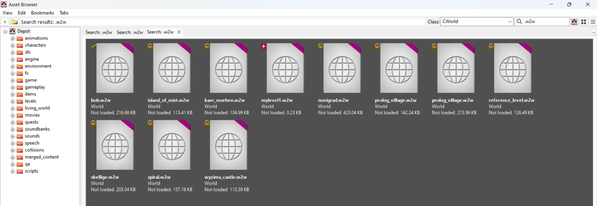
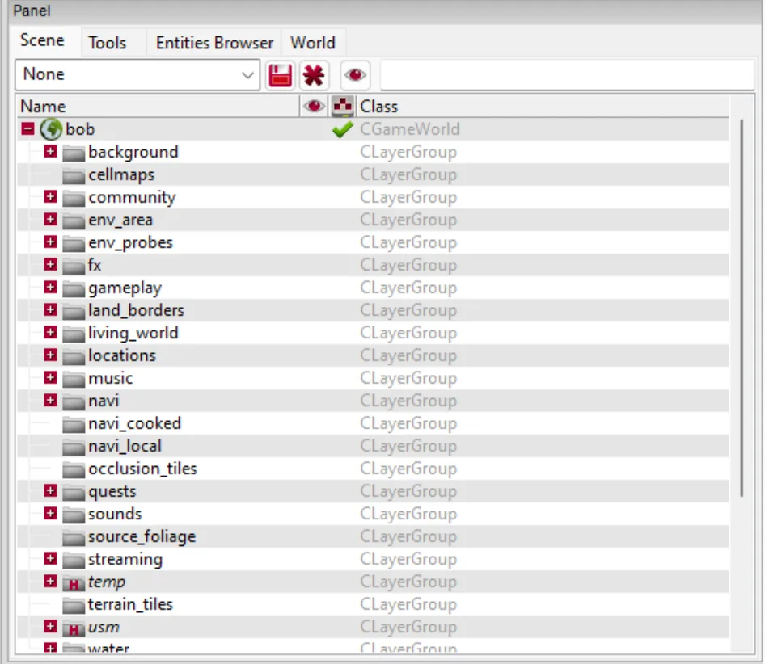

---
tags:
  - Основы
  - Общие сведения
  - Мир
  - Левел дизайн
  - world
  - level design
  - w2w

status: new

---

# World (Мир)
World (далее **Мир**) является центральной сущностью проекта REDkit и 
представляет собой основную сцену игрового уровня.

## Общие сведения

Согласно концепции Witcher 3, **Миры** разделяют игру на зоны интереса и 
реализуют отдельные участки глобальной карты.

В рамках **Мира** размещаются: ландшафт, игровые объекты (меши, сущности), триггеры, 
скрипты и прочие элементы взаимодействия с игроком.

К имеющимся игровым мирам можно отнести Белый сад, Новиград, Скеллиге и прочие.

## Работа с мирами
Для начала работы потребуется загрузить имеющийся или создать собственный **Мир**.

Так как наилучшим способом знакомства с REDkit является изучение оригинального контента игры, 
в первую очередь рассмотрим способы поиска и открытия уже имеющихся игровых миров.

### Загрузка существующего мира
Для открытия игрового **Мира** потребуется найти один из файлов формата W2W в asset Browser.

Несмотря на то, что большая часть миров расположена в ожидаемых местах (например папка "levels"), 
самым быстрым и эффективным способом найти нужный мир будет использование встроенного поиска.

Для этого:
1. В окне "Class:" выберете тип "CWorld"
2. В окне поиска укажите ".w2w". 
3. Убедитесь, что выбран режим поиска по всей библиотеке 
4. Нажмите Enter.

В результате поиска вы сможете увидеть все имеющиеся игровые миры, в том числе и созданные вами. 
Для открытия мира нажмите Enter или двойной щелчок левой кнопкой мыши.

!!! info "Подсказка"
    Чтобы найти расположение найденного файла, 
    нажмите правую кнопку мыши по файлу и выберите "Go to resource home"

## Создание нового мира
В случае, если вы уже готовы приступить созданию собственного мира, то сделать это очень легко. 

Для этого: 
В главном окне "World": 
1. выберете меню "File > New World"
2. В открывшемся окне укажите имя вашего игрового **Мира**.
3. При необходимости укажите имя DLC (см. раздел "Особенности DLC" ниже)

### Особенности DLC

В The Witcher 3 существует разделение на:
1. Основную (ванильную) игру
2. Дополнения (DLC)

Для мода, интегрируемого в основную игру, поле "DLC name" можно оставить пустым.

Для самостоятельного DLC необходимо указать имя в поле "DLC name"

На самом деле это повлияет лишь на то, в каком месте asset browser редактор создаст каталог с миром.
Это будет либо `/level/название_мира` в случае пустого поля "DLC name". 
Либо `/dlc/имя_dlc/data/levels/название_мира`
Вы всегда можете перемещать мир из пространства в пространство.

## Работа с миром

### Scene

{ style="width: 75%;" }

Панель Scene отображает структуру текущего **Мира**. 
Он организован в виде иерархической структуры каталогов, 
содержащих слои с игровыми сущностями.

Каталоги являются логической группировкой для других каталогов и слоев в них. 

Например:

- `fx` - содержит слои с визуальными эффектами используемыми на уровне.
- `eniviroment` - слои с элементами окружения.
- `quest` - слои с элементами для конкретных квестов.

Слой в свою очередь объединяет основные игровые элементы, такие как мэшы, пути, 
триггеры, зоны и пр. 

[//]: # (Подробнее о слоях и особенностях работы с ними)

!!! info "Примечание"
    Хотя названия каталогов и слоев не являются строго обязательными, 
    рекомендуется следовать конвенциям именования, 
    используемым в базовой игре для лучшей организации и поддержки проекта.

### Tools
Большая часть инструментов, которые вам понадобятся для наполнения вашего **Мира** расположены в этой вкладке.

Например: Для создания рельефа потребуется инструмент "Terrain Edit Tools", 
а для тестирования анимаций для разных NPC в рамках вашего **Мира**, поможет инструмент "Test Anim".

Каждый инструмент требует отдельного обзора и в будущем будут рассмотрены в отдельных уроках.

### World

Прежде чем приступить к созданию/редактированию ландшафта, 
а так же размещению новых объектов на слоях, необходимо настроить глобальные свойства мира расположенные в данной вкладке.
Они комплексные и вы можете найти [тут](../../references/world/world_params.md) их подробное описание.

***
Автор: lxgdark
***
