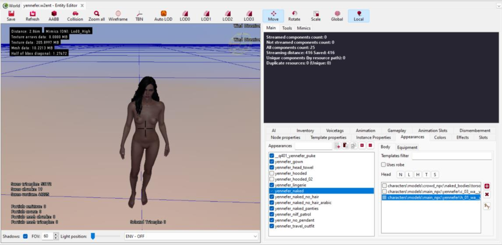
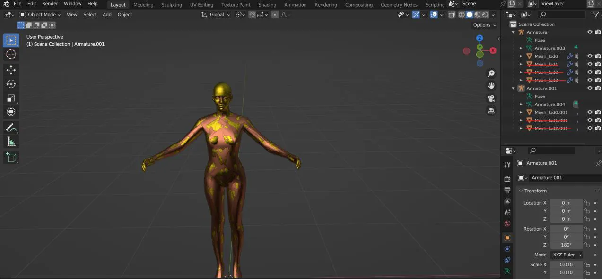
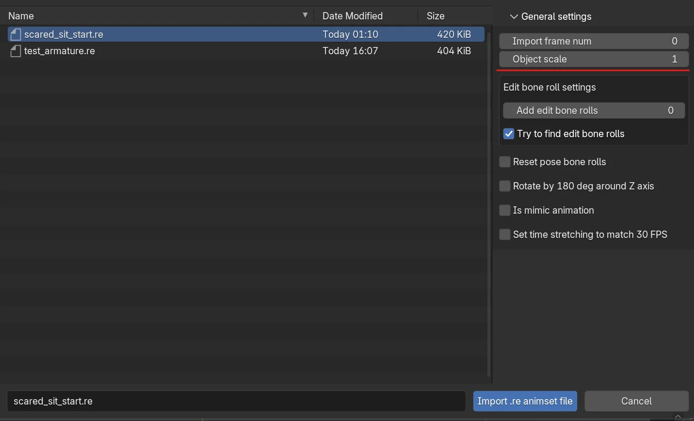
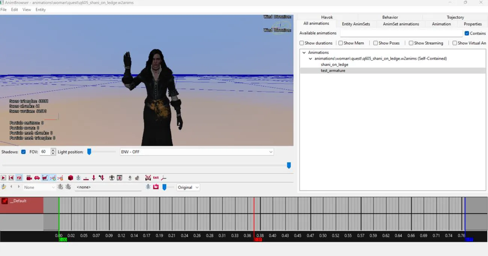

---
tags:
  - Гайд
  - Анимации
  - Animations
  - NPC
  - blender
  - Cascadeur
---

# Как создать свою анимацию для NPC

Это руководство содержит пошаговую инструкцию по созданию и внедрению собственных анимаций.

### Вам потребуются:
- [Blender](https://www.blender.org/download/) последней версии. На момент написания это версия 4.3.1.
- [Blender версии 3.6.](https://www.blender.org/download/releases/3-6/) (в которой работает важный плагин)
- (необязательно) Полная версия программы для анимирования Cascadeur. 
Free-версия не подойдет, поскольку в ней недоступна функция экспорта в формат FBX.
- Фикс [FBX Import Addon for Blender](https://www.nexusmods.com/witcher3/mods/8105). 
Я использую версию, совместимую с Blender 3.6, так как мне эта версия показалась наиболее стабильной.
- (необязательно) Плагин [Сascadeur Bridge for Blender](https://github.com/arcsikex/cascadeur_bridge). 
Версия плагина зависит от вашей версии Cascadeur (читайте описание плагина). 
Плагин устанавливается на актуальную версию Blender.

## Шаг первый. Выбор модели, для которой будут создаваться анимации.
Для начала определитесь, для какого NPC вы будете создавать анимацию. Выбор важен, так как
базовые скелеты у разных персонажей отличаются, даже если это люди разного пола. 
В случае с другими расами различия будут еще больше.

!!! note "Комментарий"
    Анимации для главного героя будут рассматриваться в отдельном уроке, так как в этом случае могут 
    возникнуть дополнительные нюансы.

Для демонстрации в рамках этого урока я создам анимацию для человека женщины. 
В качестве примера возьмем Йеннифер. Откроем ее основной шаблон сущности (**Entity**):

`characters\npc_entities\main_npc\yennefer.w2ent`

1. Перейдите на вкладку «**Apearances**». Здесь отображается перечень список вариантов внешности для данного
персонажа. Этот список поможет нам найти исходные модели, с которыми мы будем работать.
Выберем вариант, с которых хотим поработать.

    !!! note "Комментарий"
        В идеале анимации должны быть универсальными и не зависимыми от внешнего вида персонажа. 
        Однако если анимация напрямую связана с элементами одежды,
        выбирайте вариант с этой одеждой.

    Так как я планирую создать простую анимацию, наиболее удобным будет использовать не обременению
    лишними деталями модель - **yennefer_naked**.

    

    После выбора варианта внешнего вида справа отобразится из чего он состоит. Простейший вариант
    состоит из тела, головы и волос. Нам понадобится только тело и голова.

2. Дважды щелкните на элемент в списке, и вы перейдете к нему в **Asset Browser**. 
Эти действия помогут нам найти отдельные части Йеннифер в иерархии папок, но это ещё не то, что
нам нужно.

3. Теперь, когда вы нашли шаблон конкретного элемента, откройте его и найдите в графе элемент,
который отвечает за **mesh** (модель) элемента.

    

4. Внизу, в списке свойств вы увидите путь к модели. 
Нажмите на значок лупы в строке с путем, и нужный нам файл будет выделен в **Asset Browser**. 
В моем случае:

    `characters\models\main_npc\yennefer\h_01_wa__yennefer\h_01_wa__yennefer_hq.w2mesh`

5. Нажмите на файл правой кнопкой мыши и выберете **«Export Asset»**. 
Сохраните файл FBX в удобное место.
Повторите этот процесс для второй части тела.

!!! info "Информация"
    Весь описанный процесс нужен, чтобы найти необходимые нам модели для частей тела. 
    Если вы уже знаете, где находятся требуемые mesh, вы можете сразу перейти к их экспорту в FBX.

## Шаг второй. Подготовка модели.
На этом этапе нам нужно предварительно подготовить модель к анимированию.

Для этого потребуется [Blender 3.6](https://www.blender.org/download/releases/3-6/) 
с установленным фиксом [FBX Import Addon for Blender](https://github.com/arcsikex/cascadeur_bridge). 
Обратите внимание, что это не самостоятельный аддон, а именно фикс для существующего аддона импорта FBX.
Устанавливаете его, следуя инструкции на старице фикса.

!!! note "Комментарий"
    Вы можете использовать другую версию Blender, опираясь на доступные вариации фикса.
    Однако, по моему опыту, наиболее стабильной оказалась версия для Blender 3.6.

### Импорт файлов FBX
После установки фикса откройте Blender 3.6 и удалите все стартовые элементы. 
Затем выполните следующие шаги:

1. Перейдите в меню: «File --> Import --> FBX». 
2. Выберите оба файла, которые вы ранее экспортировали из **REDkit**. 
3. В настройках импорта обязательно измените значения для **Primary Bone Axis** и **Secondary Bone Axis**.
    - Установите X/-Y (это отличается от рекомендаций разработчиков в их обучающей статье).
    
    !!! note ""
        В ходе экспериментов я обнаружил, что именно такие настройки работают корректно.
        Позже в процессе работы я объясню, почему.

### Разбор ситуации с FBX
Прежде чем продолжить, давайте разберемся что тут происходит.

При стандартном импорте FBX теряется информация о привязке скелета к модели.
Это означает, что вы не сможете управлять моделью, манипулируя скелетом. 
Именно для решения этой проблемы мы используем версию Blender 3.6 с фиксом от сообщества.

### Подготовка модели

После импорта моделей выполните следующее:

**Очистите её от лишних элементов.**

Удалите вариации моделей для разной дальности (LOD). Для этого выделите соответствующие элементы в списке и нажмите **x**.

**Объедините части модели.**

Чтобы упростить дальнейшую работу, объедините голову и тело в одну модель. 
Для этого:

- Зажмите ++shift++ и выделите в окне редактора голову и тело (порядок выбора важен). 
- Нажмите ++ctrl+j++, чтобы объединить их в единое целое.

**Очистите лишние данные в блоке Armature.001.**

Этот блок содержит информацию о костях, которая в рамках нашей задачи не нужна (она касается мимики, не которая рассматривается в этом уроке).

Удалите этот элемент аналогично удалению LOD.

!!! success ""
    Подготовительный этап окончен. Модель готова для дальнейшей работы.

## Шаг третий. Начало анимирования.

Дальнейшая работа будет проходить в актуальной версии Blender (в моем случае это 4.3.1 из Steam). 

### Перенос модели в новую версию Blender
1. Откройте актуальную версию Blender параллельно с уже открытой версией 3.6.
2. Вернитесь в Blender 3.6, щелкните на пустое место редактора и нажмите ++a++, чтобы выделить все элементы.
3. Скопируйте их, нажав ++ctrl+c++, затем перейдите в актуальную версию Blender.
4. Вставьте скопированное, нажимая ++ctrl+v++.

На данный момент модель почти готова к анимированию, однако содержит несколько проблем которые нужно решить. 

1. Текущая вариация костей не подходит для создания анимаций, 
2. У головы есть ошибки в весах, так как модель рассчитана на наличие мимики

Исправим оба момента по очереди.

### Исправление костей

Для решения проблемы с костями можно использовать простой лайфхак — подгрузить готовую анимацию поверх текущей модели.

1. Установите аддон от разработчиков, позволяющий импортировать файлы формата `.re` в Blender.
    Инструкцию по установке аддона можно найти в этом [видео](https://www.youtube.com/watch?v=wXQRwfslN4Q).
2. Определитесь с анимацией, которую будете использовать как основу. Так как в конечном итоге нам нужна только одна поза, 
   выбор анимации должен быть основан на наличии в ней подходящей позы. Например:
       - Если вы хотите начать анимацию с обычной позы, то найдите любою анимацию, которая так же начинается с нее. 
       - Eсли же вы хотите, что бы ваша анимация продолжала другую, то берите ту, что нужно продолжить 
       (далее мы сможем взять финальную позу и продолжить с нее).

    !!! warning "Важно"
        Анимация должна быть выбрана среди набора для текущего типа NPC. В нашем случае человек-женщина.

    !!! info "Информация"
        Все анимации расположены в папке «**Animation**» в файлах `.w2anims` 
        В видео выше показан пример, как выбрать анимацию и сохранить ее в формат `.re`

3. После выбора и экспорта анимации вернитесь в Blender. 
    - В списке элементов выделите «**Armature**» и нажмите правую кнопку мыши. 
    - Выберите пункт меню «**Replace Animation from an .re file**».
    - В настройках импорта обязательно установите пункт «Object scale» в единицу.

    

Если вы сделали все верно, скелет будет заменен на более верный, 
при нажатии пробела модель будет выполнять загруженную анимацию.

!!! warning "Обратите внимание"
    Если вместо пункта «Replace Animation…», вы выберете **Import**, 
    анимация загрузится отдельно и будет представлять из себя пустой скелет. 
    Поскольку этот импорт не содержит настроек координат, важно, чтобы модель, 
    на которую будет наложен скелет, совпадала с ним по направлению. 
    Именно это позволяет определить какие параметры стоит выбрать при импорте FBX в описанной выше стадии. 
    Так как скелет смотрит в сторону -Y, его мы и выбрали при импорте.

### Исправление весов
Теперь переходим ко второй проблеме

{ style="width: 30%;" }

Часть элементов лица не реагируют анимацию, так как не содержат информации о весе. 

Исправим это вручную:

1. Выберите модель и перейдите в режим редактирования «**Weight Paint**»
2. В верхней части интерфейса, в списке вершин, выберите «**head**»

    

3. Добавьте вес проблемным областям, нажав на них несколько раз.
4. Если вы все сделали правильно, проблема исчезнет.

    

!!! success "Можно работать" 
    На текущий момент вы уже можете создавать новую анимацию прямо в Blender, 
    если обладаете необходимым навыком, однако я планирую использовать более продвинутый инструмент.

## Шаг четвертый. Cascadeur.

Cascadeur — это программа для создания анимаций с ключевой особенностью: физически корректное поведение. 
Создавая анимации в Cascadeur, вы сильно упрощаете свою задачу, 
что позволяет гораздо быстрее получить более плавные и физически реалистичные анимации.

!!! warning "Важно"
    К сожалению, бесплатная версия программы не поддерживает экспорт в FBX, 
    что делает невозможным возврат работы обратно.
    Поэтому если у вас нет возможности купить полную версию (например, в «зёленом магазине»), 
    вы можете пропустить эту часть урока.

### Передача модели в Cascadeur

Чтобы начать работу, нужно передать нашу модель в Cascadeur.

Хотя можно воспользоваться стандартным процессом импорта/экспорта FBX, энтузиаст 
[Aron Nemeth](https://www.youtube.com/@AronNemeth95) 
создал гораздо более удобный инструмент — [Сascadeur Bridge for Blender](https://github.com/arcsikex/cascadeur_bridge). 

Этот плагин позволяет Blender и Cascadeur взаимодействовать напрямую без мороки с файлами.

1. Скачайте и установите этот плагин, убедившись, что его версия соответствует вашей версии Cascadeur.
(у меня это Cascadeur 2023.1 и плагин версии 1.0.0)

2. Настройте плагин, следуя инструкциям разработчика. Подробное описание работы плагина можно найти
[ в этом видео](https://www.youtube.com/watch?v=0muo9EPIPSE).

### Сопоставление скелета

Для полноценного использования возможностей программы нужно сопоставить скелет
нашей модели с внутренней системой Cascadeur.

Это легко делается с помощью встроенного инструмента, работа которого описана [тут](https://www.youtube.com/watch?v=gPOh1MT8Tlk).

После выполнения сопоставление не забудьте экспортировать (сохранить) настройки для будущего использования.

В результате проделанной работы мы получим следующий результат:

!!! success "Успех"
    Теперь вы можете создавать анимацию, опираясь на многочисленные обучающие видеоуроки в интернете.

### Возврат анимации в Blender

После завершения создания анимации:
1. Вернитесь в Blender и выделите арматуру объекта.
2. В модуле аддона Сascadeur Bridge нажмите «Import Action». 
3. Спустя какое-то время анимация перенесется в Blender.

Теперь мы готовы перенести анимацию в REDkit.

## Шаг пятый. Добавление/замена анимации в REDkit.

Для экспорта анимации в игру:

1. В Blender выберите меню «File --> Export --> RE» введите желаемое имя и нажмите **Export**.

    !!! warning "Внимание"
        Выбор имени для вашей анимации важен, так как может вызвать проблемы в случае применения ее в опредёленных сценариях: 
    
        - Если эта анимация отвечает за поведение, 
        её имя должно совпадать с именем из другого набора анимаций для поведения.
    
        !!! note ""
            Краткую справку о системе поведений смотрите [тут](../base/behavior/behavior.md)
    
        - Если анимация предназначена для сцен, убедитесь, что имя отражает её суть, чтобы 
        облегчить поиск в будущем.

2. После создания файла .re, вернитесь в REDkit. 
3. Выберите набор анимаций, к которому вы добавите новую анимацию (или создайте новый набор). 
4. Откройте набор и нажмите на его имя на вкладе «**All animation**», 
затем правой кнопкой мыши выберите «**import simple/plain animation**».

Йен машет вам рукой. Помашите ей в ответ 😊

!!! note "Примечание"
    Существует некоторые подводные камни и проблемы, с которыми вы можете столкнуться в процессе работы с собственными 
    анимациями в REDkit. Эти моменты будут рассмотрены отдельно.

***
Автор: lxgdark

*Документация поддерживается участниками сообщества [REDkit RU](https://discord.gg/kRTEy8KcNa)*
***