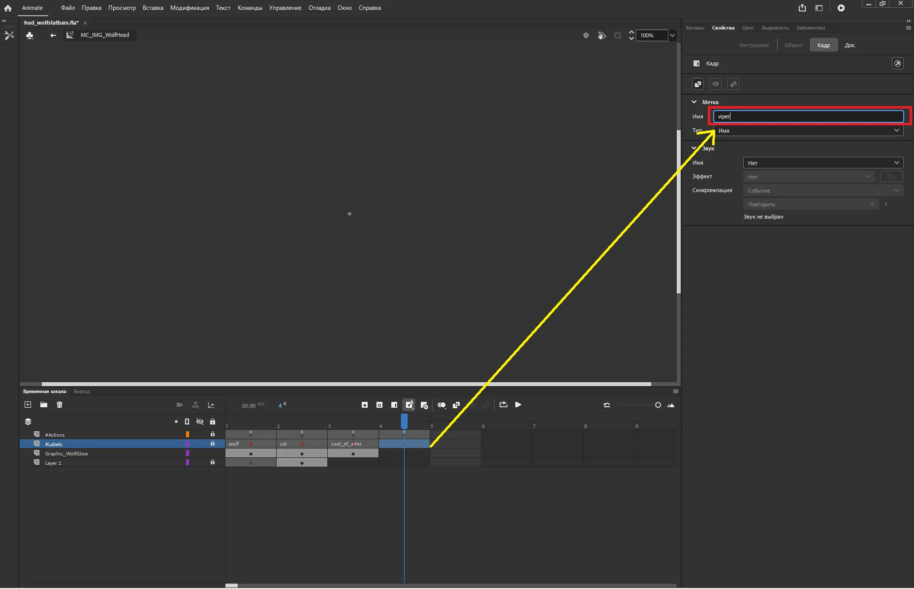
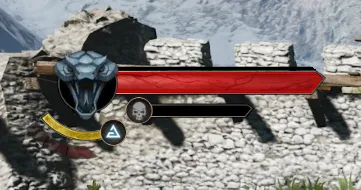

---
tags:
  - Гайд
  - UI
  - Скрипты
  - Flash
  - Adobe Animate
  - .fla
  - .swf
  - .redswf
  - .as
  - .ws

status: new

---

# Как создать свой медальон в hud

В игре можно менять медальоны в HUD, это происходит при смене игрока на Цири и во время игры за Витольда в DLC. 

В этом гайде мы пошагово добавим свою иконку медальона и заменим её.

**Немного теории**:

Интерфейс в игре сделан на Adobe Flash. Элементы UI это в основном movie clip компоненты. 

У каждого может быть покадровая анимация и именно это используется для переключения различных состояний интерфейса. 
Каждый кадр анимации — это фактически отдельный "слой", который можно включать и выключать.

Через этот гайд мы разберемся, как устроена система переключения на примере. 
Это поможет не только заменить иконку медальона, но и научиться переключать любые части UI и вы глубже поймёте, как устроен UI.


**Что понадобится:**:

- **Adobe Animate** - для редактирования .fla и сборки .swf _(Где достать софт Adobe - догадаетесь сами)_
- **Visual Studio Code** с плагином [ActionScript & MXML](https://marketplace.visualstudio.com/items/?itemName=bowlerhatllc.vscode-as3mxml)
(опционально - для удобства работы с Action Script)


## Шаг 0. Копируем нужные файлы

Чтобы удобно работать с интерфейсом, зачекаутите всю директорию `gui_new` в свой workspace:

- Перейдите в `папка_redkit\r4data\gameplay` и скопируйте оттуда папку **gui_new**
- Вставьте ее в ваш workspace в папку **gameplay**
- Чтобы редактор не думал, что вы отредактировали весь UI, в папке `workspace\gui_new\swf` 
и всех подпапках удалите все файлы с расширением `.redswf`

## Шаг 1. Добавляем иконку в fla

- Откройте файл `gui_new\fla\witcher3\hud\hud_wolfstatbars.fla` в **Adobe Animate**
- На временной шкале найдите `mcWolfsHead`
- Выделите первый кадр и нажите **F9**
- Откроется меню действий, найдите **MC_IMG_WolfHead** и кликните по любому кадру


Вас перебросит внутрь компонента. Там будет 4 слоя и по 3 кадра для каждого медальона.

На слое **#Actions**:

- ПКМ --> **Добавить пустой ключевой кадр**
- В свойствах (если свойств не видно, зайдите в **Окно** и ткните на **Свойства**) нажмите на стрелочку, это откроет текстовый редактор
- В него вставьте одну строку:
    ```actionscript linenums="1"
    stop();
    ```
    


На слое **#Labels**:

- ПКМ --> **Добавить пустой ключевой кадр**
- В его свойствах задайте имя, это идентификатор который нужен Action Script для выбора кадра.
    

На слое **Graphic_WolfGlow**:

- ПКМ --> **Добавить пустой ключевой кадр**
- Перетащите свою иконку из проводника прямо на сцену
- Разместите ее и масштабируйте как нужно мышкой или в свойствах на вкладке объект
    

Сохраняем `.fla` ++ctrl+s++, пока сворачиваем Animate и идем дальше.

## Шаг 2. Пишем функцию для замены медальона

Нам нужна функция в Action Script, которая будет менять медальон.

1. Инициализируйте новый проект **vscode** в директории `gui_new\actionscript`.
2. Перейдите в файл `red\game\witcher3\hud\modules\HudModuleWolfHead.as`
3. Добавьте новую публичную функцию, например я добавлю такую:

```actionscript linenums="1"
public function setLethoAsMainCharacter( value : Boolean )
{
   if ( value )
   {
       mcWolfsHead.SetMedalionGraphic("viper");
   }
   else
   {
       mcWolfsHead.SetMedalionGraphic("wolf");
   }
}
```

??? tip "А теперь давайте разберемся, что тут происходит"

    Мы вызываем `SetMedalionGraphic`, которая делает вот что:
    
    ```actionscript linenums="1"

    public function SetMedalionGraphic( value : String )
    {
        gotoAndStop(value);
        mcWolfGlow = getChildByName("mcWolfGlow") as MovieClip;
        mcWolfGlow.gotoAndStop(1);
    }
    ```
    
    Эта функция находится в red\game\witcher3\hud\modules\wolfHead\WolfMedallion.as
    
    Это хороший референс, как устроено переключение. По этому примеру можно написать функцию переключения других частей.

Сохраняем файл и идем дальше.

## Шаг 3. Компилируем redswf

1. Вернитесь в Adobe Animate. 
2. Файл --> Опубликовать. 

    !!!warning "Важно!"
        Если файл swf read-only (например, из-за perforce) - Animate выдаст ошибку. 
        Нужно открыть на редактирование файл `gui_new\swf\hud\hud_wolfstatbars.swf`

3. Перейдите в REDkit в папку `gameplay\gui_new\swf\hud`
4. ПКМ --> **Import** --> **Flash SWF** 
5. Укажите путь к вышеуказанному SWF, подтвердите замену и checkout

## Шаг 4. Подключаем функцию в witcher script

1. Перейдите в Tools --> Script Studio
2. Создайте новый файл скрипта, где вам удобно и вставьте отредактировав то, что отмечено комментариями: 

```ws linenums="1"
@addField(CR4HudModuleWolfHead)
// Новая переменная для объекта функции flash, назовите как хотите
private var m_fxSetLethoAsMainCharacter : CScriptedFlashFunction; 

@replaceMethod(CR4HudModuleWolfHead)
function OnConfigUI()
{
    var flashModule : CScriptedFlashSprite;
    var hud : CR4ScriptedHud;
    
    m_anchorName = "mcAnchorWolfHead";
    
    super.OnConfigUI();
    
    flashModule = GetModuleFlash();	
    
    m_fxSetVitality						= flashModule.GetMemberFlashFunction( "setVitality" );
    m_fxSetStamina						= flashModule.GetMemberFlashFunction( "setStamina" );
    m_fxSetToxicity						= flashModule.GetMemberFlashFunction( "setToxicity" );
    m_fxSetExperience					= flashModule.GetMemberFlashFunction( "setExperience" );
    m_fxSetLockedToxicity				= flashModule.GetMemberFlashFunction( "setLockedToxicity" );
    m_fxSetDeadlyToxicity				= flashModule.GetMemberFlashFunction( "setDeadlyToxicity" );
    m_fxShowStaminaNeeded				= flashModule.GetMemberFlashFunction( "showStaminaNeeded" );
    m_fxSwitchWolfActivation			= flashModule.GetMemberFlashFunction( "switchWolfActivation" );
    m_fxSetSignIconSFF 					= flashModule.GetMemberFlashFunction( "setSignIcon" );
    m_fxSetSignTextSFF 					= flashModule.GetMemberFlashFunction( "setSignText" );
    m_fxSetFocusPointsSFF				= flashModule.GetMemberFlashFunction( "setFocusPoints" );
    m_fxSetFocusProgressSFF				= flashModule.GetMemberFlashFunction( "UpdateFocusPointsBar" );
    m_fxLockFocusPointsSFF				= flashModule.GetMemberFlashFunction( "lockFocusPoints" );
    m_fxSetCiriAsMainCharacter			= flashModule.GetMemberFlashFunction( "setCiriAsMainCharacter" );
    m_fxSetCoatOfArms					= flashModule.GetMemberFlashFunction( "setCoatOfArms" );
    m_fxSetShowNewLevelIndicator		= flashModule.GetMemberFlashFunction( "setShowNewLevelIndicator" );
    m_fxSetAlwaysDisplayed				= flashModule.GetMemberFlashFunction( "setAlwaysDisplayed" );
    m_fxshowMutationFeedback			= flashModule.GetMemberFlashFunction( "showMutationFeedback" );

    // Название новой созданной переменной
    // Заменить setLethoAsMainCharacter на название функции из шага 2
    m_fxSetLethoAsMainCharacter         = flashModule.GetMemberFlashFunction("setLethoAsMainCharacter"); 
    
    m_CurrentSelectedSign = thePlayer.GetEquippedSign();
    m_fxSetSignIconSFF.InvokeSelfOneArg(FlashArgString(GetSignIcon()));
    
    SetTickInterval( 0.5 );
    hud = (CR4ScriptedHud)theGame.GetHud();
    if (hud)
    {
        hud.UpdateHudConfig('WolfMedalion', true);
    }
    DisplayNewLevelIndicator();
    
    UpdateCoatOfArms();
}

@addMethod(CR4HudModuleWolfHead)
// Новая функция для смены медальона, назовите как хотите.
public function SetLethoAsMainCharacter(value : bool)
{
    // Переменную подставить вашу
    m_fxSetLethoAsMainCharacter.InvokeSelfOneArg(FlashArgBool(value));
}
```

## Шаг 5. Тестовая функция

Cоздадим тестовую функцию для смены медальона, заодно на ее примере будет понятно, как работать с этим:

```ws linenums="1"
// Назовите как хотите
exec function test_set_letho_hud(val : bool)
{
    var hud : CR4ScriptedHud;
    var hudWolfHeadModule : CR4HudModuleWolfHead;      

    hud = (CR4ScriptedHud)theGame.GetHud();
    if (hud)
    {
        hudWolfHeadModule = (CR4HudModuleWolfHead)hud.GetHudModule("WolfHeadModule");
        if (hudWolfHeadModule)
        {
            hudWolfHeadModule.SetLethoAsMainCharacter(val); // Функцию подставить вашу
        }
    }
}

```
Сверху в Script Studio нажмите на красный квадратик с двумя стрелками - это компиляция скриптов:


Никаких ошибок в консоли не должно быть, последняя строка: `Script compilation finished successfully.`

!!! success "Готово!"
    Выполните в консоли команду и передайте в нее true ( в моем случае test_set_letho_hud(true) ), 
    убедитесь, что медальон заменился.

    

***
Автор: leviofanh

*Документация поддерживается участниками сообщества [REDkit RU](https://discord.gg/kRTEy8KcNa)*
***


